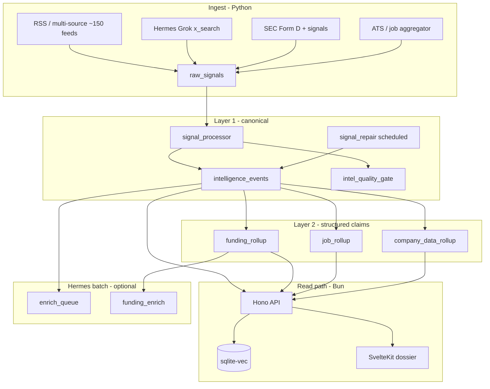

# Competitor Intel — Product & Engineering Roadmap

**Status:** Living document · **Last updated:** 2026-05-20  
**Authority:** This file is the **single source of truth** for what we build, in what order, and how we know we are done.

### How to use this doc

| Role | Read |
|------|------|
| Implementing a feature or fix | Find your **Track** and **ID** below; check the box when merged |
| Understanding data flow / commands | [PIPELINE.md](PIPELINE.md) (operational reference) |
| Evidence behind a finding | [audit-file-by-file-2026-05-19.md](audit-file-by-file-2026-05-19.md) (40-shard census) |
| **Sign-off per track (required before next track)** | **[SIGNOFF.md](SIGNOFF.md)** |
| Day-to-day commands & schema | [HANDBOOK.md](HANDBOOK.md) |

**Rule:** New work gets a roadmap ID (P0–P4 or X-##). PR titles should reference IDs. Do not add parallel `phase_*` scripts or duplicate rollup entrypoints.

---

## 1. Product vision

### What we are building

An **investor-grade private company intelligence platform**: maximum auditable signal on startups and private tech companies, low-latency search and dossiers, and a UI people trust for due diligence (funding, team, jobs, regulatory, momentum) — not a generic news aggregator.

### Who it is for

- Operators and analysts monitoring a curated company set  
- Investors researching companies before outreach or allocation  
- Eventually: small teams / SaaS customers (after Tracks 0–3)

### Product principles

1. **Provenance over volume** — every claim links to sources; corroboration visible in UI  
2. **One canonical timeline** — Layer 1 events are not duplicated by side-channel collectors  
3. **Verified vs inferred** — funding KPIs distinguish corroborated totals from rumors  
4. **Fast read path** — API and dashboard optimized for dossier + search; heavy work in batch  
5. **Bleeding edge where it matters** — Bun/Hono, Svelte 5, sqlite-vec; not rewrite-for-rewrite  

### North-star capabilities (investor dossier)

| # | Capability | Depends on |
|---|------------|------------|
| N1 | Single event timeline with source URLs | Track 0–1 (processor, dedup, one funding path) |
| N2 | Funding rounds + investors + corroboration | Track 1–2 (rollup, API, company funding tab) |
| N3 | Verified vs total raised on KPI | Track 2 (API field + UI) |
| N4 | Team, products, licenses from claims | Track 1–2 (company_data aggregate fix, tabs) |
| N5 | Jobs + hiring velocity, scoped freshness | Track 0 (stale bug), Track 2 (UI badges) |
| N6 | Regulatory (MiCA, Form D) on dossier | Track 1 ongoing + rollup enablement |
| N7 | Sub-second FTS + semantic search | Track 2 (sqlite-vec, no API subprocess) |
| N8 | Pipeline health + source freshness in UI | Track 2 (status API, TanStack) |

---

## 2. Current state (post–40-shard census)

**Verdict:** Strong **internal intel pipeline** for a single operator on SQLite (WAL). **Tracks 0–5** cover engineering exit criteria (pipeline, dossier MVP, CI, hardening, dossier depth) — see [ROADMAP_PRODUCTION.md](ROADMAP_PRODUCTION.md) for what “production product” still requires.

| Area | Today | Remaining gap |
|------|--------|----------------|
| Signal layer | Gate in daily; abort on failure; repair before gate | Substring fuzzy match; legacy bypass collectors |
| Collectors (~74 modules) | Broad ingest; core path tests | Contract tests for long tail |
| Rollups (funding, jobs, company) | Daily funding + optional company rollup | Single funding writer; Hermes enrich |
| API (Bun + Hono) | Mutation auth + CORS; GET public | Read auth; semantic search in-process |
| Dashboard (Svelte 5) | Company dossier shell | Search UX; design system unify |
| CI / quality | `.github/workflows/ci.yml`; `make enterprise-check` | Dashboard tests; claims-audit fail thresholds |
| Enterprise package | Shadow RSS via `CI_ENTERPRISE_RSS` (off) | P4-2 freeze decision |

**Census:** 40 shards complete — see [audit-file-by-file-2026-05-19.md](audit-file-by-file-2026-05-19.md).

---

## 3. Target architecture (12 months)



### Layer definitions

| Layer | Tables / artifacts | Rule |
|-------|-------------------|------|
| **Ingest** | `raw_signals` | Collectors only write here (+ domain-specific staging). Use `insert_raw_signal_dedup`. |
| **Layer 1** | `intelligence_events` | **Only** `signal_processor` (+ documented repair/gate) creates events. |
| **Layer 2** | `funding_rounds`, claims, `job_postings`, profile claims | Rollups read Layer 1; Hermes apply is idempotent enrichment. |
| **Read** | API + dashboard | Read-only SQLite (or RW replica for mutations later). No Python on hot search path. |

### Canonical entrypoints (do not fork)

| Job | Entry |
|-----|--------|
| Daily pipeline | `apps/worker/daily_intel.py` via `make daily` / `integrations/hermes/call_intel.sh daily` |
| Registry | `apps/worker/automation/collector_registry.py` |
| Signal quality | `make intel-all` (repair + gate + tests) |
| Rollups | `make rollup-all` |
| **Do not use** | ~~`automation/daily_intel.py`~~ (removed 2026-05-19) |

---

## 4. Stack decisions

### Keep

| Layer | Choice | Notes |
|-------|--------|-------|
| Read API | **Bun + Hono 4** + `bun:sqlite` | Already migrated; enforce read-only for production |
| Collectors | **Python 3.12+**, httpx, feedparser 6, curl-cffi | ~74 modules; I/O-bound |
| Dashboard | **SvelteKit 2 + Svelte 5 + Tailwind 4** | Expand TanStack Query; no React rewrite |
| Embeddings | **Ollama `nomic-embed-text`** | Fix zero-vector fallback on failure |
| Database (now) | **SQLite WAL** + `CI_DB_PATH` | Single operator / single corpus |

### Build / change (roadmap-owned)

| When | Change |
|------|--------|
| Track 0 | Fail-fast daily; PYTHONPATH for `parallel_collect` |
| Track 1 | `intel_quality_gate` in daily; shared `funding_parse.py` |
| Track 2 | **sqlite-vec** in API; TanStack Query everywhere; unified `ci-*` design |
| Track 3 | GitHub Actions; ruff + pytest + Vitest API smoke |
| Track 4 | SQLite ops hardening; API rate limits; regulatory rollup; entity resolution |
| Track 5 | Cap table ingest; dossier licenses + cap table tabs |

### Defer

| Item | Trigger |
|------|---------|
| Multi-tenant billing / RBAC | Product decision for hosted SaaS |
| Rust collectors | Profiling proves Python ingest bottleneck |
| FastAPI | Public OpenAPI SDK requirement |
| Enterprise SQLAlchemy merge | Explicit P4-2 decision only |

---

## 5. Implementation tracks

Work **in order**: **Track 0–1** complete for single-operator use. Start **Track 2** for product/search; keep **Track 3** CI green on every PR (`make enterprise-check`).

---

### Track 0 — Pipeline & API safety

**Duration:** 1–2 weeks  
**Exit criteria:** Daily job fails on bad ingest; API does not advertise broken mutations; dedup index enforced.

| Done | ID | Task | Primary files / commands |
|------|-----|------|---------------------------|
| [x] | P0-1 | API: read-only surface **or** separate RW connection for alerts/discovery | `apps/api/src/db.ts`, `alerts.ts`, `discovery.ts` |
| [x] | P0-2 | API auth + CORS allowlist | `apps/api/src/index.ts`, `middleware/auth.ts` |
| [x] | P0-3 | **Single path** to `intelligence_events` — remove `funding_collector` / `big_deals` from pre-processor extraction | `run_intel.py`, `collector_registry.py` |
| [x] | P0-4 | Enforce `idx_raw_signals_dedup`; handle `IntegrityError` on parallel ingest | `py-core/db/ingest.py`, `migrate_dedup.py` |
| [x] | P0-5 | Daily **fail-fast** after parallel/extraction failure (`--force` optional) | `apps/worker/daily_intel.py` |
| [x] | X-01 | Fix `parallel_collect` — `PYTHONPATH` includes `apps/worker` in `run_script` | `apps/worker/automation/run_utils.py` |
| [x] | X-03 | `hackernews_collector`: add `import sqlite3` | `hackernews_collector.py` |
| [x] | X-04 | Jobs: scope stale deactivation by processed `company_id` | `jobs/job_aggregator.py` |
| [x] | — | ~~Delete stale `automation/daily_intel.py`~~ | P1-7 (done 2026-05-19) |
| [x] | — | Document canonical entry in `AGENTS.md` + `HANDBOOK.md` | docs only |
| [x] | — | Verify prod DB has dedup index: `make migrate-dedup` | `idx_raw_signals_dedup` on prod DB |

**Verify:**

```bash
export CI_DB_PATH="$PWD/data/competitor_intel.db"
make daily          # must fail if parallel_collect fails (after fix)
make intel-gate     # orphans=0
```

---

### Track 1 — Data integrity & rollups

**Duration:** 2–4 weeks  
**Exit criteria:** One funding→events path; gate runs in daily; repair scheduled; rollups trustworthy.

| Done | ID | Task | Primary files |
|------|-----|------|---------------|
| [x] | P1-1 | Wire `intel_quality_gate` after `signal_processor` in daily | `collector_registry.py` |
| [x] | P1-2 | Schedule `signal_repair` (weekly cron or pre-gate) | daily sequential + `SCHEDULING.md` |
| [x] | X-05 | Processor: classify on **merged** text (URL-only → not Unlabeled) | `signal_processor.py` |
| [x] | X-06 | Repair: `backfill_funding_amounts` **before** `reclassify_misfunded_events` | `signal_repair.py` |
| [x] | P1-3 | Extract shared `funding_parse.py` | new module; 4 call sites + enhanced detector |
| [x] | P1-4 | Register or delete unregistered collector scripts | `collector_registry.py`, `tests/test_collector_registry.py` |
| [x] | P1-5 | `big_deals`: schema via migrations, not runtime ALTER | `migrations.py`, collector |
| [x] | P1-6 | Alerts: dedup + wire `alert_rules` or document hardcoded-only | `alert_engine.py` |
| [x] | P1-8 | Hermes path via env; default off in CI | `integrations/hermes/` |
| [x] | — | Fix `funding_rumor_detector` valuation scaling | `funding_rumor_detector.py` |
| [x] | — | `enhanced_funding_detector`: `cluster_key` + prune safety | collector |
| [x] | — | Resolver: reduce substring false positives; refresh alias cache | `signal_company_resolver.py` |
| [x] | — | `company_data` aggregate: expand beyond 7 keys | `enrichment/company_data/aggregate.py` |
| [x] | — | Full `make rollup-all` on prod set; record counts in §12 Progress log | ops |

**Verify:**

```bash
make intel-all
make rollup-all
make claims-audit
```

---

### Track 2 — Investor product surface

**Duration:** 3–6 weeks  
**Exit criteria:** Search works; dossier shows provenance; no placeholder settings; fast semantic search.

| Done | ID | Task | Primary files |
|------|-----|------|---------------|
| [x] | P2-1 | API contract tests (Vitest + `hono.request`) | `apps/api/test/routes.test.ts` |
| [x] | P2-2 | Fix search: `$state` + URL sync; slug links in results | `search/+page.svelte` |
| [x] | P2-3 | Settings: real counts from `/api/status` or remove placeholders | `status.ts`, `ingest_catalog.json` |
| [x] | P2-4 | Migrate legacy `slate-*` pages to `ci-*` tokens | funding/jobs detail → `ci-page` |
| [x] | P2-5 | TanStack Query on lists and dossier | companies/funding/jobs + detail `[id]` |
| [x] | P2-6 | Hermes company enrich export/apply (mirror funding) | `company_enrich_*.py`, Makefile |
| [x] | P2-7 | Dossier: team/products tabs + corroboration badges | products tab, `CorroborationBadge` |
| [x] | P2-8 | `fields_provenance` / sources on funding tab | dossier funding table + profile provenance hint |
| [x] | X-07 | Native semantic search in Bun (Ollama + embeddings) | `nativeSemanticSearch.ts`; Python optional |
| [x] | X-08 | (same as P2-2) | |
| [x] | X-09 | Show `verified_raised_usd`, participants, sources on company page | KPI + funding tab columns |
| [x] | X-12 | Unify provenance components on design tokens | `CorroborationBadge` |
| [ ] | — | Funding/job detail: reactive to route param (not `onMount` only) | `[id]/+page.svelte` |
| [ ] | — | Company tabs in URL hash or query | dossier routes |
| [ ] | — | API Zod for all query params | `apps/api/src/schemas.ts` |
| [ ] | — | Profile claims API (`/api/profile/claims` or dossier embed) | new route |
| [ ] | — | Dashboard E2E smoke (optional Playwright) | `apps/dashboard/` |

**Maps to north-star:** N1–N8.

---

### Track 3 — Engineering platform

**Duration:** 2–3 weeks (start in parallel with Track 1)  
**Exit criteria:** PRs cannot merge red; lint + tests + golden eval required.

| Done | ID | Task |
|------|-----|------|
| [~] | P3-1 | GitHub Actions: `uv sync`, pytest, `make intel-gate`, API test, `make lint-py` / `lint-js`, dashboard check |
| [x] | P3-2 | `make lint` = ruff + ty + Oxfmt/Oxlint + dashboard check; [docs/LINTING.md](LINTING.md) |
| [x] | P3-3 | JS lint/format via Oxlint + Oxfmt at repo root (replaces API eslint/prettier scripts) |
| [x] | P3-4 | Widen coverage gate: rollup, gate, repair modules |
| [x] | P3-5 | Collector contract tests (respx) for priority ingest paths |
| [x] | P3-6 | `daily_intel --dry-run` + integration test (mock registry) |
| [x] | P3-7 | Bare-metal health: `scripts/healthcheck.sh`, `make health-check` (no Docker) |
| [x] | P3-8 | Removed stale `pyrightconfig.json`; ty is type-check SSOT |
| [x] | X-10 | Contract tests in `tests/test_collector_contracts.py` (RSS, HN, http) |
| [x] | X-13 | `collectors/` symlink + registry tests (`test_collector_registry.py`) |
| [x] | X-14 | `call_intel.sh grok-x-ingest` → `make grok-x-ingest` |

**Pre-commit:** `.pre-commit-config.yaml` (ruff + ruff-format).

---

### Track 4 — Hosted product

**Duration:** Quarter+  
**Exit criteria:** Deployable multi-user stack with auth, backups, observability.

| Done | ID | Task |
|------|-----|------|
| [x] | P4-1 | SQLite operational excellence (`docs/SQLITE.md`, WAL tuning, `assert_enterprise_sqlite_safe`) |
| [x] | P4-2 | **Freeze** `py-enterprise` — `docs/ENTERPRISE_FREEZE.md` + `assert_enterprise_sqlite_safe()` |
| [x] | P4-3 | API rate limits — `apps/api/src/middleware/rateLimit.ts` (`CI_API_RATE_LIMIT_RPM`) |
| [x] | P4-4 | Worker step IDs + JSON `pipeline_step` logs in `run_utils.log_pipeline_step` |
| [x] | P4-5 | SEC / regulatory bulk → license claims (`regulatory_extract`, daily `regulatory_license_rollup`) |
| [x] | P4-6 | Entity resolution (`company_aliases`) + cap table schema + `/api/cap-table` |
| [ ] | — | Billing, orgs, RBAC — product phase 2 (SQLite stays single-tenant) |
| [x] | X-11 | Enterprise collectors blocked on default prod SQLite (`enterprise_guard`) |

---

### Track 5 — Investor dossier depth

**Duration:** 2–4 weeks  
**Exit criteria:** Cap table populated from funding rounds; dossier shows licenses and cap table.

| Done | ID | Task |
|------|-----|------|
| [x] | P5-1 | Cap table rollup (`cap_table_rollup.py`, daily after funding rollup) |
| [x] | P5-2 | Dossier licenses tab (`license_claims` + `regulatory_licenses`) |
| [x] | P5-3 | Dossier cap table tab |
| [ ] | P5-4 | Billing / multi-tenant — deferred |

**Docs:** [TRACK5_DOSSIER_DEPTH.md](TRACK5_DOSSIER_DEPTH.md)

---

### Track 6 — Production product

**In progress (planning).** Full phased plan (~80+ task IDs), enterprise launch definition, framework verdict, verification gates: [ROADMAP_PRODUCTION.md](ROADMAP_PRODUCTION.md) (updated after 29-agent audit).

Tracks 0–5 = pipeline + dossier MVP + CI + hardening + dossier tabs in code. Track 6 = prod data, deploy, supply chain, AI trust, collector bugs, observability, tests, optional WAN.

---

## 6. Unified backlog (all IDs)

Severity: **P0** = ship blocker · **P1** = data trust · **P2** = product · **P3** = eng · **P4** = SaaS

### P0 — Do not expose externally

| ID | Finding | Fix |
|----|---------|-----|
| P0-1 | Read-only DB + alert/discovery writes | RW path or remove mutations |
| P0-2 | No auth / open CORS | API key or proxy; allowlist |
| P0-3 | Duplicate funding → events | Single canonical processor path |
| P0-4 | Dedup race on parallel ingest | Unique index + `IntegrityError` |
| P0-5 | Daily continues after failure | Fail-fast / `--force` |

### P1 — Pipeline & data quality

| ID | Finding | Fix |
|----|---------|-----|
| P1-1 | Gate not in daily | Registry after processor |
| P1-2 | Repair manual only | Cron / pre-gate |
| P1-3 | Four copies of funding parse | `funding_parse.py` |
| P1-4 | Unregistered collectors | Register or delete |
| P1-5 | `big_deals` runtime ALTER | Migrations |
| P1-6 | Alerts ignore DB rules | Wire or document |
| P1-7 | ~~Stale `automation/daily_intel.py`~~ | **Done** — file removed |
| P1-8 | Hardcoded Hermes paths | Env injection |

### P2 — Product surface

| ID | Finding | Fix |
|----|---------|-----|
| P2-1 | Zero API/dashboard tests | Vitest + Playwright |
| P2-2 | Search page broken | `$state` + URL |
| P2-3 | Settings placeholders | Wire status API |
| P2-4 | Dual design system | `ci-*` migration |
| P2-5 | TanStack inconsistent | Standardize |
| P2-6 | Hermes company enrich | Export/apply |
| P2-7 | Team/products UI | Tabs + badges |
| P2-8 | Provenance on dossier | API + UI |

### P3 — Engineering excellence

| ID | Finding | Fix |
|----|---------|-----|
| P3-1 | No CI | GitHub Actions |
| P3-2 | ruff/mypy not run | `make lint` |
| P3-3 | API ESLint missing | config |
| P3-4 | Coverage too narrow | extend includes |
| P3-5 | Collector contract tests | respx |
| P3-6 | No daily integration test | mock registry |
| P3-7 | Bare-metal health script | `make health-check` |
| P3-8 | Stale pyright paths | fix/remove |

### P4 — Hosted / enterprise (later)

| ID | Finding | Fix |
|----|---------|-----|
| P4-1 | SQLite single file | WAL + backup runbook (`SQLITE.md`) |
| P4-2 | Enterprise duplicate stack | Freeze / archive |
| P4-3 | No rate limits | middleware |
| P4-4 | Limited observability | logs/metrics |
| P4-5 | Regulatory → claims gap | collectors + rollup |
| P4-6 | No cap table | new domain |

### X — Cross-cutting (from 40-shard census)

| ID | Sev | Finding | Track |
|----|-----|---------|-------|
| X-01 | P0 | `parallel_collect` import failure | 0 |
| X-02 | P0 | Daily continues on failure | 0 |
| X-03 | P0 | HN missing `sqlite3` | 0 |
| X-04 | P0 | Jobs global stale deactivation | 0 |
| X-05 | P1 | URL-only Unlabeled bug | 1 |
| X-06 | P1 | Repair order | 1 |
| X-07 | P1 | Semantic search subprocess | 2 |
| X-08 | P1 | Search bind bug | 2 |
| X-09 | P1 | Dossier funding provenance | 2 |
| X-10 | P2 | ~50 collectors untested | 3 |
| X-11 | P2 | Enterprise on prod DB | 4 |
| X-12 | P2 | Dual design system | 2 |
| X-13 | P3 | Stale `intel.py` paths | 3 |
| X-14 | P3 | Hermes grok-x doc mismatch | 3 |

---

## 7. Ongoing intel coverage (parallel to tracks)

Not blocked on SaaS — feeds core value. Pick items when Tracks 0–1 are stable.

| Priority | Work | Module / command |
|----------|------|------------------|
| **Now** | Funding investor depth | `funding_enricher`, Hermes apply |
| **Now** | Team from press / SEC / YC | `company_data`, collectors |
| **Next** | License RSS (FCA/ECB) → `license_claims` | new collectors |
| **Next** | HTTP contract tests per ingest | `tests/` + respx |
| **Next** | Fanout backlog + `url_fanout_done` filter | `signal_url_fanout.py` |
| **Later** | GitHub metrics accuracy | `github_collector.py` |
| **Later** | Momentum persist + API trending align | `momentum_detector.py` |
| **Later** | Leadership NER | Hermes or extractor |

---

## 8. Hermes enrichment workflow

X/Twitter is **not** scraped via REST from this repo. Grok (Hermes) returns JSON; Python persists.

| Step | Command |
|------|---------|
| Event labels / `company_id` | `make enrich-queue-export` → `enrich-queue-apply` |
| Funding investors & deal fields | `make funding-enrich-export` → `funding-enrich-apply` |
| Deterministic relink | `make relink-actionable` |
| X batch | `make grok-refresh` / `call_intel.sh` (align X-14) |

See [architecture/HERMES_INTEGRATION.md](architecture/HERMES_INTEGRATION.md) and [integrations/hermes/README.md](../integrations/hermes/README.md). **No** embedded Hermes imports in collectors — HTTP/CLI only.

---

## 9. Collector census map (file → shard)

All paths under `packages/py-collectors/collectors/`.

| Shard | Modules |
|-------|---------|
| C01 | `signal_processor.py` |
| C02 | `signal_company_resolver.py` |
| C03 | `signal_repair.py`, `intel_quality_gate.py` |
| C04 | `signal_url_fanout.py`, `entity_extract.py` |
| C05 | `funding_collector.py`, `big_deals_collector.py`, `enhanced_funding_detector.py`, `funding_rumor_detector.py` |
| C06 | `funding_rollup.py` |
| C07 | `enrichment/funding_enricher.py`, `funding_aggregator.py`, `funding_investors.py`, `funding_source_trust.py` |
| C08 | `enrichment/company_data/*` |
| C09 | `company_data_rollup.py`, `enrichment/company_enricher.py`, `enrichment/company_valuation.py` |
| C10 | `jobs/*` |
| C11 | `rss_collector.py`, `sources_registry.py` |
| C12 | `multi_source_collector.py`, `continuous_ingest.py` |
| C13 | `github_collector.py`, `github_signals.py`, `enrichment/github_deep.py` |
| C14 | `hackernews_collector.py`, `producthunt_collector.py`, `crunchbase_collector.py`, `angellist_collector.py`, `yc_collector.py` |
| C15 | `x_signal_collector.py`, `x_monitor.py`, `grok_x_fetcher.py`, `ollama_client.py` |
| C16 | `website_monitor.py`, `edgar_collector.py`, `edgar_form_d_bulk.py`, `techcrunch_edgar_collector.py`, `tech_stack_detector.py` |
| C17 | `company_discovery.py`, `candidate_discovery.py`, `company_ranker.py`, `auto_promote.py`, `investor_collector.py` |
| C18 | `competitor_mapper.py`, `momentum_detector.py`, `reactive_enrichment.py`, `enhanced_signal_collector.py` |
| C19 | `job_rollup.py`, `enrichment/enrichment_runner.py`, `enrichment/embedding_generator.py`, `enrichment/reranker.py`, `enrichment/confidence_scoring.py`, `enrichment/confidence_sync.py` |
| C20 | `esma_mica_collector.py`, `youtube_collector.py`, `enrichment/utils.py` |
| — | `company_match.py`, `job_tracker.py` (cross-cutting; see audit) |

**Worker / API / dashboard:** W01–W06, A01–A04, D01–D05 — see audit doc.

---

## 10. Makefile quick reference

| Target | When |
|--------|------|
| `make daily` | Production ingest (after Track 0) |
| `make intel-all` | Before release: repair + gate + tests |
| `make intel-gate` | CI gate on signal quality |
| `make golden-eval` | Classifier regression |
| `make rollup-all` | Funding + jobs + company rollups |
| `make claims-audit` | Claim counts sanity |
| `make lint` | Track 3 — all linters |
| `make test-cov` | Python coverage (narrow until P3-4) |

Full table: [PIPELINE.md](PIPELINE.md#makefile-quick-reference).

---

## 11. What we will not do (without explicit decision)

- Rewrite collectors in Rust or Go  
- Migrate dashboard to React/Next.js  
- Run enterprise SQLAlchemy collectors against prod DB (P4-2)  
- Add `scripts/phase_*` or second daily orchestrator  
- In-repo Ollama headline classifier (Hermes owns agent Q&A)  
- Second database engine (Postgres, etc.) — SQLite remains canonical  

---

## 12. Progress log

Update this section when a **track exit criteria** is met.

| Date | Milestone | Notes |
|------|-----------|-------|
| 2026-05-19 | 40-shard census complete | Audit + roadmap published |
| 2026-05-19 | Docs cleanup | Removed phase/duplicate audits; consolidated index; deleted stale `automation/daily_intel.py` |
| 2026-05-19 | Track 0 complete | Dedup index on prod DB; docs; fail-fast + tests |
| 2026-05-19 | Track 1 (partial) | P1-1/P1-2, X-05/X-06; repair relinked 897; gate passes except `general_news_pct` 68.9 (threshold 65) |
| 2026-05-19 | Track 1 (partial) | P1-3 + repair: `funding_parse.py`; reclassify + minimal→Unlabeled; `make intel-gate` PASS (general_news_pct 58.8) |
| 2026-05-19 | Track 1 (partial) | P1-4: all 44 collector `__main__` scripts in registry; `intel.py` uses `INTEL_CLI_COLLECTORS` paths |
| 2026-05-19 | Track 1 complete | P1-5–P1-8 + rumor/enhanced/resolver/aggregate; `intel-gate` PASS; rollup: funding_rounds=313, claims=885, company_details=59 |
| 2026-05-19 | Track 0+1 audit | Code review vs ROADMAP; see session audit summary (all Track 0/1 checkboxes satisfied) |
| 2026-05-19 | T0/T1 sign-off | [SIGNOFF.md](SIGNOFF.md) blocks signed; `make enterprise-check` green |
| 2026-05-19 | Track 2 started | P2-1 API routes tests; P2-2 search URL+slug; P2-3 status ingest catalog |
| 2026-05-20 | Track 2 complete | P2-4–P2-8, X-07/X-09/X-12; native semantic; dossier products/verified raised; `docs/SIGNOFF.md` |
| 2026-05-20 | Track 3 complete | CI + `make lint`; bare-metal health |
| 2026-05-20 | Track 4 foundation | SQLite-only hardening; regulatory rollup; entity resolution; [SIGNOFF.md](SIGNOFF.md) |
| 2026-05-20 | Track 5 started | Cap table rollup + dossier licenses/cap table tabs; [TRACK5_DOSSIER_DEPTH.md](TRACK5_DOSSIER_DEPTH.md) |
| 2026-05-20 | Production roadmap | 14-agent audit → [ROADMAP_PRODUCTION.md](ROADMAP_PRODUCTION.md) (Track 6) |
| 2026-05-20 | Production roadmap v2 | +15-agent wave 2 (deps, AI, collectors, SRE, launch bar) — same doc |

---

## 13. Document map

| Document | Purpose |
|----------|---------|
| **ROADMAP.md** (this file) | **What to build, priority, definition of done** |
| [SIGNOFF.md](SIGNOFF.md) | Per-track sign-off blocks (required before next track) |
| [PIPELINE.md](PIPELINE.md) | How data flows; layers; commands; defect tables (mirror of backlog) |
| [audit-file-by-file-2026-05-19.md](audit-file-by-file-2026-05-19.md) | Census evidence (40 shards) |
| [HANDBOOK.md](HANDBOOK.md) | Schema, agents, feed catalog |
| [ARCHITECTURE.md](ARCHITECTURE.md) | Dual stack, ingest API |
| [architecture/HERMES_INTEGRATION.md](architecture/HERMES_INTEGRATION.md) | Grok / enrich queues |
| [../integrations/hermes/README.md](../integrations/hermes/README.md) | `call_intel.sh` operator reference |
| [AGENT_HANDOFF.md](AGENT_HANDOFF.md) | Session handoff template |

**When audits or pipeline docs disagree with this roadmap, ROADMAP wins** — update the others to match after a deliberate change.
